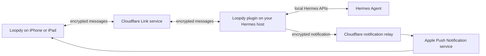

# Loopdy plugin for Hermes

Loopdy is a native iPhone and iPad client for [Hermes Agent](https://hermes-agent.nousresearch.com/docs). This plugin is the bridge that lets the Loopdy app talk to a Hermes installation without exposing the Hermes computer directly to the internet.

The short version: Loopdy sends an encrypted message through Cloudflare, this plugin delivers it to Hermes, Hermes does the work, and the plugin sends the encrypted response back to Loopdy.

## What the plugin does

After you pair Loopdy with a Hermes host, the plugin adds a `loopdy` platform to Hermes. It handles:

- Encrypted chat between Loopdy and Hermes
- Sessions and conversation history
- Hermes Project selection and bounded Git controls
- Scheduled tasks
- Approval and clarification requests
- Images, documents, video, and voice attachments
- Proactive notifications and Live Activities
- Native Loopdy cards for summaries, lists, weather, sports, stocks, charts, dashboards, and forms
- Verified device and person context for an authenticated Loopdy turn

Hermes remains in charge of agents, tools, permissions, approvals, sessions, scheduled tasks, and saved history. The plugin does not replace Hermes or create a second agent runtime.

### Native cards: current chat versus notifications

Loopdy supports two delivery paths, and they are deliberately separate:

- **Inline card in the active chat:** use the matching Loopdy renderer when it is visible in the current tool list. If Hermes progressively discloses the renderer, resolve and invoke it through the official progressive-disclosure bridge: `tool_search`, `tool_describe`, and `tool_call`.
- **Proactive or scheduled card:** send the complete card payload to the Loopdy notification channel when a scheduled job or background event needs to start a new delivery.

Do not use the notification channel just to answer the current chat. Hermes does not auto-forward a renderer result into a separate proactive delivery. Never script or reconstruct a renderer call when the direct renderer or its official progressive-disclosure path is available.

## How the pieces fit together



### In everyday language

1. **Loopdy encrypts your message on your device.** The Cloudflare Link service receives ciphertext, which is scrambled data it cannot turn back into the chat message.
2. **Cloudflare routes the encrypted message to your paired Hermes host.** Your home or work computer makes an outbound WebSocket connection, so you do not need to open a public inbound port.
3. **The plugin decrypts the message on the Hermes host and gives it to Hermes.** Hermes applies its normal agent instructions, tool permissions, approval rules, Project context, and session history.
4. **The plugin encrypts Hermes' response and sends it back through Cloudflare.** Loopdy decrypts and displays it on your device.
5. **Notifications use a separate relay.** Alert text is encrypted for the destination device before delivery through Cloudflare and Apple. Live Activities use a deliberately limited progress summary, such as whether work is running or complete, and never include full prompts, tool arguments, credentials, or attachments.

Cloudflare can observe normal service metadata such as connection timing, encrypted frame size, and opaque device coordinates. It does not have the account key needed to read Loopdy Link chat frames. The paired Hermes host can read the conversation because it must perform the requested work.

For the more exact security and data-flow details, see [SECURITY.md](SECURITY.md), [PROTOCOL.md](PROTOCOL.md), and [docs/cloudflare-infrastructure.md](docs/cloudflare-infrastructure.md).

## Requirements

- A current [Hermes Agent](https://hermes-agent.nousresearch.com/docs) installation
- The Loopdy app on an iPhone or iPad
- Outbound HTTPS and WebSocket access from the Hermes host

The plugin supports Hermes on macOS, Linux, and Windows. It does not require an inbound port, a separate system service, or Cloudflare credentials on the Hermes host.

## Install

Install and enable the plugin from this repository:

```bash
hermes plugins install promptclickrun/loopdy-plugin --enable
```

If the Hermes gateway is already running, restart it so the new platform is loaded:

```bash
hermes gateway restart
```

Then create or sign in to your Loopdy account in the app and start pairing on the Hermes host:

```bash
hermes loopdy link pair
```

The command displays a short-lived pairing code, a QR URL, and a separate 16-character verification code. In Loopdy, open **Settings > Loopdy Link > Pair a Device**. For manual pairing, enter both the short code and the verification code.

Check the connection:

```bash
hermes loopdy link status
hermes loopdy status
```

Send a test notification after the device is registered:

```bash
hermes loopdy test --target all
```

## Update

Reinstall from the latest public commit, then restart the gateway:

```bash
hermes plugins install promptclickrun/loopdy-plugin --force --enable
hermes gateway restart
```

For a reproducible install, GitHub exposes the full commit SHA. Hermes can pin that exact revision:

```bash
hermes plugins install promptclickrun/loopdy-plugin --ref FULL_40_CHARACTER_COMMIT_SHA --enable
```

## Notification delivery choices

Loopdy supports two current notification paths:

- **Relay**, the default: the host sends an authenticated encrypted alert to the Loopdy relay, which forwards it to Apple.
- **Direct APNs**, for self-hosters with an Apple Developer account: the Hermes host sends directly to Apple using an owner-provided APNs key that stays on that host.

Chat transport still uses the encrypted Loopdy Link connection in either mode. Notification delivery does not become the source of truth for chats, approvals, or session history.

## Useful commands

```text
hermes loopdy status
hermes loopdy link pair
hermes loopdy link status
hermes loopdy link unpair --yes
hermes loopdy provider relay
hermes loopdy provider direct
hermes loopdy test --target all
```

Run `hermes loopdy --help` or the relevant subcommand help for the complete options.

## Security notes

- The plugin opens outbound HTTPS and WebSocket connections only.
- Pairing gives every host a revocable device identity.
- Private device keys and the account encryption key stay on paired devices.
- The plugin stores owner-only local state under the active Hermes profile.
- Direct APNs keys must stay outside this repository and be readable only by their owner.
- Installing the plugin does not automatically make Loopdy an approval transport. That remains an explicit Hermes security setting.
- The Cloudflare Worker source and production infrastructure configuration are not part of this repository.

Please report security problems privately through the repository's GitHub security advisory page rather than opening a public issue with credentials or live protocol coordinates.

## Development

The plugin is intentionally built against Hermes' public plugin and platform surfaces. To run its complete test suite, use a Hermes source checkout or installed source tree on `PYTHONPATH`:

```bash
export HERMES_SOURCE=/path/to/hermes-agent
PYTHONPATH="$PWD:$HERMES_SOURCE" \
  "$HERMES_SOURCE/venv/bin/python" -m unittest discover -s tests -p 'test_*.py'
```

Do not commit local Hermes state, credentials, generated bytecode, caches, APNs keys, Cloudflare tokens, or production resource identifiers.

## License

Apache License 2.0. See [LICENSE](LICENSE).
