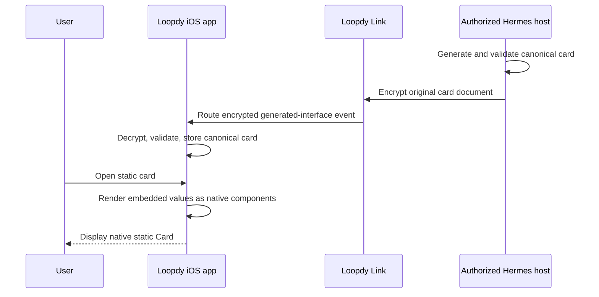

# Loopdy Cards

Loopdy Cards are declarative, display-only interfaces generated by an agent and
rendered as native SwiftUI. Build 3 ships static Cards only: every displayed
value is embedded in the payload and `data_sources` must be empty. The card is
data: it cannot contain Swift, JavaScript, HTML, a WebView, downloaded code,
arbitrary actions, or a request body. Live Card data refresh is reserved for a
later release.

The Hermes plugin validates and canonicalizes the original document, adds its
identity fields, and sends it once through the encrypted conversation path. The
iOS app validates it again before rendering. Neither side fetches Card data in
build 3.

## Complete wire example

The following is a complete `loopdy.card` version 1 document after the renderer
has added `content_hash`, `card_id`, `created_at`, and `origin`. This object is
carried in the existing generated-interface event or event detail.

```json
{
  "schema": "loopdy.card",
  "version": 1,
  "title": "Build health",
  "spoken_summary": "All twelve checks passed and the build is ready for review.",
  "importance": "important",
  "data_sources": [],
  "root": "card",
  "elements": {
    "card": {
      "type": "card",
      "props": {
        "title": "Build health",
        "subtitle": "Local verification"
      },
      "children": ["metrics", "status"]
    },
    "metrics": {
      "type": "hstack",
      "props": {
        "spacing": "medium",
        "alignment": "leading"
      },
      "children": ["passed", "failed"]
    },
    "passed": {
      "type": "metric",
      "props": {
        "label": "Passed",
        "value": { "literal": 12 },
        "format": { "style": "integer" },
        "semantic": "positive"
      },
      "children": []
    },
    "failed": {
      "type": "metric",
      "props": { "label": "Failed", "value": { "literal": 0 }, "format": { "style": "integer" }, "semantic": "neutral" },
      "children": []
    },
    "status": {
      "type": "badge",
      "props": { "value": { "literal": "Ready" }, "semantic": "positive" },
      "children": []
    }
  },
  "content_hash": "ce63fd5994bc8b091720c4c7dd4d5ecbb6344e651a6d9044143ca5fc13643d87",
  "card_id": "ce63fd5994bc8b091720c4c7dd4d5ecb",
  "created_at": "2026-09-02T12:00:00Z",
  "origin": "live"
}
```

The hash is SHA-256 over the canonical input document before the four
renderer-owned fields are added. `card_id` is the first 32 lowercase hexadecimal
characters of that hash. `importance` and `valid_until` are optional root fields
used for generic presentation and ranking; they do not grant new capabilities.

The portable input contract is
[`loopdy-card-v1.schema.json`](../plugins/loopdy/spec/loopdy-card-v1.schema.json).
The plugin validator and the iOS validator remain authoritative for limits and
cross-field rules that JSON Schema alone cannot express.

## Finite component catalog

Version 1 recognizes exactly the following component types. Every element has
`type`, `props`, and `children`; unknown types, props, and enum values fail
validation.

| Type | Purpose | Allowed props | Children |
|---|---|---|---|
| `card` | Titled native container | `title`, `subtitle` | Up to 20 |
| `vstack` | Vertical layout | `spacing`, `alignment` | Up to 20 |
| `hstack` | Horizontal layout | `spacing`, `alignment` | Up to 20 |
| `grid` | Two- or three-column layout | `columns`, `spacing`, `alignment` | Up to 20 |
| `text` | Text value | `value`, `format`, `typography`, `color`, `alignment`, `line_limit` | None |
| `metric` | Label and prominent value with optional trend | `label`, `value`, `format`, `trend`, `trend_format`, `semantic` | None |
| `badge` | Short semantic status | `value`, `semantic` | None |
| `progress` | Value bounded by a declared maximum | `label`, `value`, `maximum`, `format`, `semantic` | None |
| `chart` | Line, area, or bar series | `kind`, `description`, `series` | None |
| `table` | Bounded columns and rows | `columns`, `rows` | None |
| `list` | Repeated template over a source array | `items`, `empty_text`, `shows_dividers` | Exactly one template child |
| `divider` | Native divider | `semantic` | None |
| `spacer` | Token-based spacing | `size` | None |
| `image` | Bundled SF Symbol or app asset | `name`, `accessibility_label`, `semantic`, `scale` | None |

Colors are limited to `primary`, `secondary`, `positive`, `warning`, `negative`,
`accent`, and `neutral`. Spacing is limited to `none`, `xsmall`, `small`,
`medium`, `large`, and `xlarge`. Typography is limited to `caption`, `body`,
`callout`, `headline`, `title`, and `large_title`. The document cannot provide
RGB values, font names, font sizes, frames, coordinates, blur radii, arbitrary
SF Symbol names, or SwiftUI modifiers. Version 1 images are bundled symbols or
assets only; remote image decoding is not supported.

## Bindings, expressions, and formatting

A component value in build 3 uses the literal binding form:

```json
{ "literal": "Open" }
```

Source bindings, JSON Pointer resolution, and expressions are reserved for a
later live-data release. They are not valid in build-3 delivered Cards.

The only format styles are `text`, `integer`, `number`, `currency`, `percent`,
`date`, `time`, and `relative_date`. The app owns locale-aware formatting.

## Build-3 delivery sequence



There is no Card network request, polling loop, background refresh, or catch-up
loop in build 3. The canonical transcript document, its hash, and its card ID
remain unchanged.

## Live-data policy

Live data is unavailable in build 3. The plugin schema permits zero data
sources, the plugin validator rejects nonempty `data_sources`, the iOS envelope
validator rejects them again, and the production data client fails closed.
Network-policy and source-binding code retained for development is not a shipped
capability and must not be described to agents or users as active.

The main contract limits are:

- 64 KiB per encoded card document
- Zero data sources, 80 elements, tree depth 12, and 20 children per container
- Eight table columns and 50 rows
- Six chart series and 120 points per series
- 50 rendered list items


## Trust boundaries and privacy

| Boundary | Receives or controls | Does not receive or control |
|---|---|---|
| Hermes agent and plugin | User intent, embedded Card values, canonicalization, validation, content hash | Device credentials or executable Card code |
| Loopdy Link | Encrypted original Card event and routing metadata | Decrypted Card content under the documented Link assumptions |
| Loopdy iOS app | Decrypted Card, embedded values, native rendering | Executable code supplied by a Card or live Card source traffic |
| Third-party Card source host | Nothing in build 3 | Device IP, Card values, account keys, credentials, or transcript |
| Loopdy notification infrastructure | No Card refresh request or response | Decrypted Card content or live source traffic |
| Template catalog and stores | Reviewed template data, metadata, integrity values, parameters, and install state | Native executable extensions or automatic permission expansion |

Build 3 makes no third-party Card request, so opening a Card does not disclose a
device IP address, request URL, timing, or query to a Card source host. Embedded
values still travel through the ordinary encrypted conversation path and remain
subject to the documented endpoint and provider trust boundaries.

## Visible states and failures

Static Cards render their embedded values without freshness or polling state.
`Invalid card element` or `Unsupported card element` replaces malformed or
unknown presentation content with an error label rather than executing it.

A document that fails envelope or card validation is not rendered as a Loopdy
Card. Unknown versions, unknown components or props, nonempty data sources,
broken references, cycles, unreachable elements, duplicate IDs, bad hashes, and
limit violations fail closed. Legacy generated interfaces continue through
their existing renderer.

## Template lifecycle

A template bundle is declarative data with `id`, `version`, `name`, `summary`,
`author`, `license`, `minimum_card_version`, `parameters_schema`, `document`, and
`sha256`.

1. A catalog detail view shows the author, license, version, and requested
   component types before installation.
2. The app verifies catalog and bundle integrity, card-version support, the
   embedded card, and parameter schema before an atomic install. A failed update
   leaves the prior version intact; downgrades and hash mismatches are rejected.
3. Installed templates use account-scoped crash-safe storage, not UserDefaults.
4. Installation synchronizes the template through account-encrypted Loopdy Link
   operations named `cards.templates.install`. Listing and removal use
   `cards.templates.list` and `cards.templates.remove`.
5. The plugin stores templates per profile and exposes generic search, detail,
   and render tools. Template rendering still ends at the same
   `loopdy_render_card` validation boundary.
6. Parameters can replace declared literal slots only. They cannot replace a
   component type, element ID, binding, operation, or renderer-owned field.
7. Removing a template deletes its install state and synchronization record. It
   does not rewrite cards already stored in transcripts.

Templates never install native code or add new component capabilities. No
production catalog URL is configured in this repository. Public catalog
publication requires a separately reviewed catalog repository, governance,
signing-key custody, and an explicit open-source license.

## Compatibility and non-goals

`loopdy.card` version 1 is a new schema alongside `loopdy.generative_ui`
versions 1 and 2. Existing generated cards and forms remain on the legacy
renderer. Loopdy Cards do not reinterpret or silently upgrade those envelopes,
and version 1 remains display-only. Existing `loopdy_render_form` continues to
own user input and request-bound form submissions.

Version 1 is not:

- A programmable runtime, web-rendering surface, or downloaded extension model.
- An interaction or form-submission protocol.
- An authenticated API client or a place to carry credentials and secrets.
- A streaming, polling, or background-refresh protocol.
- A remote-image pipeline. Images are limited to the allowlisted bundled symbols
  and assets.

- A commitment to a public catalog endpoint. This repository configures none.
- An API-compatibility layer for any related generative-interface project.

## Design credit

Loopdy Cards credits Sameer Gupta's
[Generative UI DSL](https://github.com/sameergdogg/generative-ui) as an influence
on the constrained JSON-tree and fixed native component-catalog approach.
[Google A2UI](https://github.com/google/A2UI) and
[`json-render`](https://json-render.dev/) are related designs only. Loopdy does
not claim adoption, endorsement, API compatibility, or copied code from any of
these projects.
