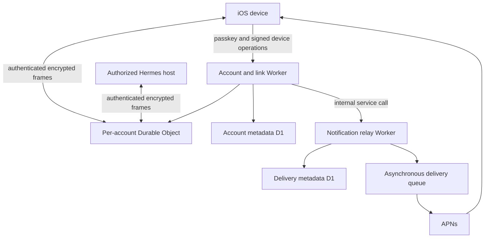

# Cloudflare infrastructure

This document describes the deployed Loopdy services based on read-only
verification performed on August 29, 2026. It omits non-public production
identifiers, private routes, database and namespace identifiers, schema
definitions, anti-abuse thresholds, exact retention intervals, and secrets.
The public client service origin and public app identifiers necessarily remain
visible in the application bundle.

The Cloudflare deployment has two Loopdy Workers, two D1 databases, one Durable
Object namespace, an asynchronous delivery queue with dead-letter handling, and
an internal service binding. The Loopdy Workers do not currently bind KV or R2.

## 1. Logical topology

## 2. Account and link Worker

The account/link Worker is responsible for:

- Passkey registration and assertion challenges
- Verification of WebAuthn responses
- Short-lived access authorization
- Device public-key registration and revocation
- Encrypted device-label storage
- Pairing challenge coordination
- Signed device-management operations
- WebSocket admission
- Routing a connection to the correct per-account Durable Object
- Passing push and Live Activity enrollment to the relay through an internal
  service binding

It is not responsible for running agents or storing readable chat sessions.

### Durable account metadata

The account database holds the minimum durable material needed for identity and
authorization:

- Opaque account coordinates
- Passkey public credential material
- Expiring authentication challenges
- Hashed access-session tokens
- Device public keys and authorization state
- Pairing challenges and replay-prevention metadata
- An encrypted account-key envelope

The passkey biometric or device-unlock secret never leaves the Apple
authentication system. The client creates the account content key; the service
stores only its encrypted envelope.

## 3. Per-account Durable Object

The account/link Worker maps each account to one Durable Object instance that
coordinates authorized endpoints. The object stores only:

- Authorized-host routing grants
- Frame identifiers and sequencing metadata
- A count-bounded queue of encrypted frames awaiting delivery

The queued frame body is ciphertext created by an endpoint holding the account
key. The deployed Worker has no frame-decryption path. Frames are removed after
an authenticated recipient acknowledgement or when the affected endpoint is
revoked. We found no independent time-based expiration for offline Link frames.
Do not describe this storage as automatically short-lived.

This Durable Object is a coordination mechanism, not a conversation database.

## 4. Notification relay Worker

The notification relay is isolated from the account/link Worker. It receives
authorized internal requests and manages:

- Device push registrations
- Recipient public-key coordinates
- APNs token ciphertext
- Encrypted alert payloads
- Delivery attempts and status
- Live Activity registrations and revocations
- Bounded Live Activity delivery state
- Nonces, idempotency receipts, tombstones, and aggregate usage counters
- Asynchronous APNs delivery through a queue

The relay encrypts push tokens and alert payloads at rest. The authorized source
encrypts human-readable notification content for the destination device before
APNs delivery.

Live Activity updates are different from alert notifications: they contain a
deliberately reduced, generic progress projection suitable for a Lock Screen
surface. They must not contain prompts, tool inputs, unrestricted model output,
credentials, or private attachments.

## 5. What Cloudflare can and cannot see

### Cloudflare can process

- Source network metadata inherent to an HTTPS/WebSocket service
- Connection timing and duration
- Ciphertext sizes
- Opaque account, device, frame, and delivery coordinates
- Public keys and authorization epochs
- Encrypted device labels
- Encrypted APNs tokens and encrypted alert payloads
- Generic Live Activity progress state
- Delivery status, coarse presence, and aggregate usage counters

### Not available to the deployed frame-routing path

- Chat prompts or replies carried inside Loopdy Link frames
- Attachment bytes carried inside Loopdy Link frames
- Voice transcripts or synthesized audio carried inside Loopdy Link frames
- Agent instructions and workspace operations carried inside Loopdy Link frames
- Private account content keys
- Device signing private keys
- Notification recipient private keys
- Passkey biometric or device-unlock secrets

This does not make the system anonymous. Infrastructure providers can still
observe network and routing metadata, and the authorized Hermes host receives
plaintext because it must perform the requested work. Pairing keys are bound to
a host-generated commitment carried in the QR code or compared as a separate
16-character manual verification code.

## 6. Session storage statement

Loopdy's Cloudflare deployment does **not** contain a database of readable
sessions, messages, or transcripts.

Encrypted frames may be held while an authorized endpoint is offline. That
ciphertext is deleted after recipient acknowledgement or endpoint revocation.
The iOS app may cache readable session state. The authorized Hermes host may
maintain it according to its configuration.

The current service exposes device revocation and passkey-authorized account
deletion. Account deletion revokes push and Live Activity routes, deletes the
account/device directory rows, closes sockets, and purges the per-account
Durable Object twice around the directory deletion to close authenticated-request
races. Infrastructure backups and provider recovery systems can still outlive
logical deletion according to their configured policies.

## 7. Operational safety

Production operations should preserve these invariants:

- Never log plaintext frame bodies, credentials, push tokens, or decrypted alert
  content.
- Keep all public traffic on TLS.
- Restrict internal service bindings to the minimum required services.
- Keep secrets in Cloudflare secret bindings, not source or plain-text
  variables.
- Preserve replay protection, bounded parsing, and authorization-epoch checks.
- Add and verify time-based cleanup for offline frame ciphertext in addition to
  acknowledgement and revocation cleanup.
- Treat D1 migrations and Durable Object migrations as security-sensitive
  changes.
- Treat relay sender-key provisioning and rotation as part of the account
  service trust boundary; pairing-key commitment does not provide notification
  sender-key transparency.
- Test revocation from both active and offline endpoint states.
- Review privacy disclosures whenever a new durable field or storage product is
  introduced.

## 8. Reproducibility status

The Loopdy plugin repository does not currently include the Worker source, D1 migrations,
queue configuration, or infrastructure-as-code used by the deployed services.
This document describes and verifies the deployment but cannot reproduce it.

For fully reproducible open-source infrastructure, publish a separate server
repository containing:

- Worker source
- Durable Object classes and migrations
- D1 migrations
- Queue consumers
- Development-only configuration templates
- Local test harnesses
- Deployment instructions that use placeholder identifiers
- A threat model and protocol compatibility tests

Do not publish production account identifiers, resource identifiers, API
tokens, APNs credentials, signing keys, production hostnames not already meant
to be public, or live operational thresholds.
